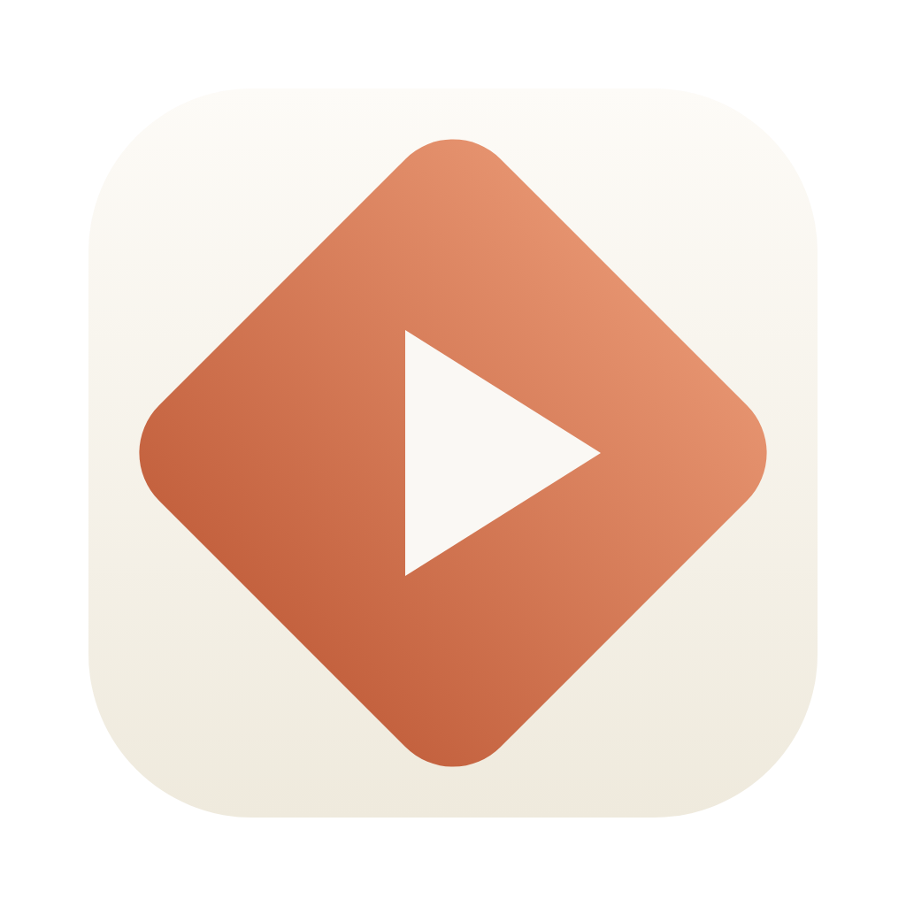

<div align="center">
  
  <h1>WorkStream</h1>
  <p><strong>Let Claude Code work while you actually enjoy the wait.</strong></p>
  <p>
    Fire off a task &rarr; flip to Stremio, YouTube, or the browser &rarr; get pulled back the moment Claude is done.
  </p>
  <p>
    
    
    
  </p>
</div>

---

## Why this exists

Claude Code tasks take time. A refactor, a test suite, a multi-step research run — you kick it off and then just sit there, switching tabs, watching tokens stream by, waiting.

WorkStream changes that flow. It runs Claude Code sessions in the background, lets you flip over to watch something, and automatically pauses playback and surfaces the cockpit the moment Claude finishes — or needs a decision from you.

You stay in the loop. You just stop wasting the idle time.

## Features

- **Claude cockpit** — start runs, browse past sessions, stream output live, answer questions and approve tool calls without leaving the app
- **Stremio** — full embedded Stremio, with its local streaming server bundled so content actually plays
- **YouTube** — YouTube embedded as a persistent tab; playback state survives switching back to Claude
- **Browser** — a minimal in-app browser for anything else, with address bar and navigation
- **Pause on finish** — when Claude needs you, playback pauses across all tabs and you're brought forward automatically
- **Shared sessions** — reads and writes the same `~/.claude` store as the Claude Code CLI; sessions you start here resume in the terminal, and vice versa
- **Background tasks** — when Claude spawns a background command, the session stays alive and the agent auto-continues when it reports back

## How it works

```
  You                   WorkStream              Claude
   │                        │                     │
   ├─ start a task ────────►│                     │
   │                        ├─ run in background ►│
   ├─ flip to Stremio ─────►│                     │
   │                        │           working...│
   │                        │◄── done ────────────┤
   │◄─ playback pauses ─────┤                     │
   │◄─ cockpit opens ───────┤                     │
   ├─ review + reply ──────►│                     │
   ├─ flip back to Stremio ►│                     │
```

## Prerequisites

- **macOS** (Apple Silicon or Intel; Stremio streaming requires Rosetta 2 on Apple Silicon)
- **Node.js 22+**
- A working **Claude Code** login — the app reuses your existing `~/.claude` credentials

## Install

Download the latest `.dmg` from the [Releases page](https://github.com/jmartins2000/WorkStream/releases), open it, and drag WorkStream to your Applications folder.

## Build from source

```bash
git clone https://github.com/jmartins2000/WorkStream.git
cd WorkStream
npm install        # also fetches the Stremio streaming server binaries
npm run dev        # hot-reload dev build (requires a display)
```

```bash
npm run typecheck  # tsc for both Node and renderer configs
npm test           # vitest unit + integration tests
npm run lint       # eslint
npm run build      # production build → ./out
npm run package    # electron-builder → ./release (.dmg + .zip)
```

## Project layout

| Path | What |
|------|------|
| `src/main/claude/` | Agent SDK integration: runner, session store, transcript parser |
| `src/main/stremio/` | Local Stremio streaming server lifecycle |
| `src/preload/` | `contextBridge` exposing a typed `window.claude` API |
| `src/renderer/` | React UI — Claude cockpit, Stremio / YouTube / Browser panes |
| `src/shared/types.ts` | Types and IPC channel names shared across all three processes |

## License

MIT
